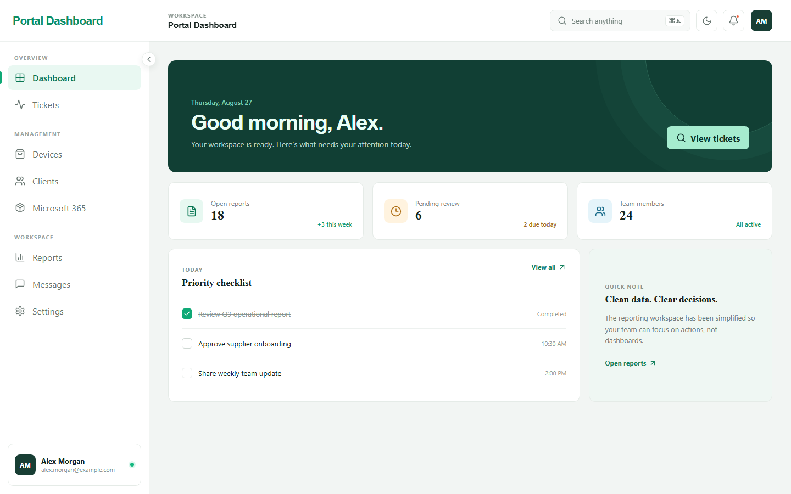

# Portal Dashboard

A responsive MSP operations portal demo inspired by the Dasher layout. The current experience includes Microsoft sign-in and interactive demo workspaces for service desk operations. Production integrations and persistence are intentionally omitted.

## Project teaser



## Demo scope

- `/login` uses Microsoft Authentication Library (MSAL) redirect sign-in for personal Microsoft accounts.
- Portal routes require an MSAL account in the browser. This client-side route boundary improves navigation but does not replace server-side authorization.
- `/tickets` uses realistic in-memory data. Search and filters, ticket details, assignment/status/severity changes, and internal notes are simulated and reset on refresh.
- `/devices`, `/clients`, `/365`, `/reports`, `/messages`, and `/settings` provide interactive frontend demonstrations backed by mock data and local state.
- The ASP.NET Core API currently supplies portal navigation only. Tickets are not persisted or sent to the API.
- API authorization, a database, attachments, notifications, SLA calculations, vendor integrations, and real-time updates are future production work.

## Stack

- React 19, TypeScript, Vite, MSAL, and Lucide icons
- ASP.NET Core 9 Web API
- Repository pattern through `INavigationRepository`
- xUnit and Vitest/React Testing Library

## Run locally

Start the API:

```powershell
dotnet run --project backend/AcrovisPortal.Api
```

In another terminal, start the frontend:

```powershell
cd frontend
npm install
Copy-Item .env.example .env.local
npm run dev
```

Open `http://localhost:5173`. Vite proxies `/api` to the API at `http://localhost:5026`.

### Microsoft Entra setup

Register a single-page application in Microsoft Entra and set its supported account type to **Personal Microsoft accounts only**. Add `http://localhost:5173` as a SPA redirect URI, copy `frontend/.env.example` to `frontend/.env.local`, then set its public Application (client) ID:

```dotenv
VITE_MSAL_CLIENT_ID=your-application-client-id
```

The frontend uses the Microsoft `consumers` authority, redirect-based sign-in, and `sessionStorage`. The client ID is public configuration; do not add a client secret. Phase 1 does not request Microsoft Graph data or send Microsoft tokens to the Acrivos API, and the ASP.NET Core API remains unprotected.

## Verify

```powershell
dotnet test AcrovisPortal.sln
cd frontend
npm test
npm run build
npm run lint
```
