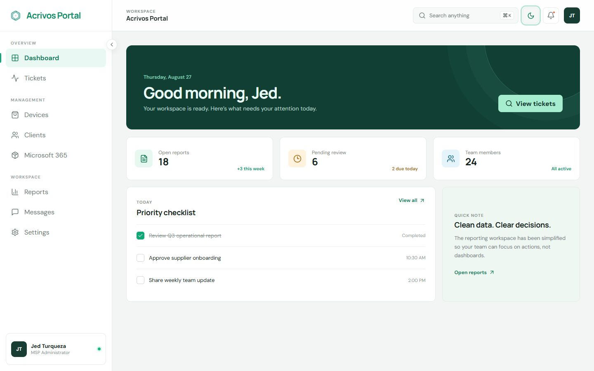

# Acrivos Portal

A responsive MSP operations portal demo inspired by the Dasher layout. The current experience includes the portal shell, a UI-only login page, and a simulated Ticketing workspace. Charting and production integrations are intentionally omitted.

## Dashboard preview



## Demo scope

- `/login` validates the form in the browser and routes to the portal; it does not authenticate a user or create a session.
- `/tickets` uses realistic in-memory data. Search and filters, ticket details, assignment/status/severity changes, and internal notes are simulated and reset on refresh.
- The ASP.NET Core API currently supplies portal navigation only. Tickets are not persisted or sent to the API.
- Authentication, authorization, a database, attachments, notifications, SLA calculations, vendor integrations, and real-time updates are future production work.

## Stack

- React 19, TypeScript, Vite, and Lucide icons
- ASP.NET Core 9 Web API
- Repository pattern through `INavigationRepository`
- xUnit and Vitest/React Testing Library

## Run locally

Start the API:

```powershell
dotnet run --project backend/AcrovisPortal.Api
```

In another terminal, start the frontend:

```powershell
cd frontend
npm install
npm run dev
```

Open `http://localhost:5173`. Vite proxies `/api` to the API at `http://localhost:5026`.

## Verify

```powershell
dotnet test AcrovisPortal.sln
cd frontend
npm test
npm run build
npm run lint
```
